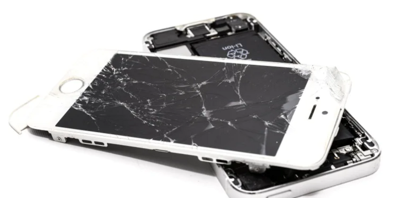

<div align="center">

# 📱 Smartphone Defect Segmentation

**스마트폰 디스플레이 결함 검출 및 세그멘테이션**



<br>

# 🏅 Tech Stack 🏅


</div>

<br>

## Project Overview

| 항목 | 내용 |
|:-----|:-----|
| **📅 Date** | 2026.01.05 ~ 2026.01.09 (5일) |
| **👥 Type** | 토이 프로젝트 |
| **🎯 Goal** | 실시간 스마트폰 결함 검출 시스템 구축 |
| **🔧 Tech Stack** | PyTorch, U-Net, OpenCV, Weights & Biases |
| **📊 Dataset** | [Kaggle Mobile Phone Defect Dataset](https://www.kaggle.com/datasets/girish17019/mobile-phone-defect-segmentation-dataset) |

<br>

## 📋 목차

- [프로젝트 소개](#-프로젝트-소개)
- [주요 기능](#-주요-기능)
- [데이터셋 구조](#-데이터셋-구조)
- [모델 아키텍처](#-모델-아키텍처)
- [설치 방법](#-설치-방법)
- [사용 방법](#-사용-방법)
- [실험 결과](#-실험-결과)
- [프로젝트 구조](#-프로젝트-구조)

<br>

## 🎬 시연 영상

<div align="center">

### 📹 모델 추론 데모

<!--
영상 추가 방법:
1. GitHub에서 이 README.md 파일을 편집 모드로 열기
2. 아래 이 위치에 비디오 파일(.mp4, .mov 등)을 드래그 앤 드롭
3. 자동으로 생성되는 링크를 그대로 두면 완료!

예시:
https://github.com/user-attachments/assets/12345678-1234-1234-1234-123456789abc/demo.mp4

또는 저장소에 assets 폴더를 만들고 비디오 파일을 넣은 후:
https://github.com/username/repository/assets/demo.mp4
-->

**⬇️ 여기에 비디오 파일을 드래그 앤 드롭하세요 ⬇️**


</div>

---

### 핵심 특징
- ✅ **현업형 포트폴리오**: 재현 가능한 학습/평가/추론 파이프라인 모듈화
- 📊 **실험 관리**: Weights & Biases (wandb) 통합
- 🔬 **다양한 모델 지원**: U-Net, FCN-8s, DeepLab v1
- 🎨 **고급 데이터 증강**: Photometric Augmentation (BGC, Blur, Noise, Specular, ColorJitter)
- ⚡ **Early Stopping**: 과적합 방지 및 효율적인 학습

### 결함 유형
| 유형 | 설명 |
|------|------|
| 🔪 **Scratch** | 스크래치 결함 |
| 💧 **Oil** | 오일 얼룩 |
| 🌫️ **Stain** | 일반 얼룩 |
| ✅ **Good** | 정상 디스플레이 |

---

## 🌟 주요 기능

### 1️⃣ 다중 모델 아키텍처
```python
# U-Net: 대칭적 인코더-디코더 구조
# FCN-8s: Skip Connection을 활용한 세밀한 세그멘테이션
# DeepLab v1: Atrous Convolution을 활용한 고해상도 특징 추출
```

### 2️⃣ 포괄적인 데이터 증강

#### 📸 기본 증강 (Photometric Augmentation)
- **Brightness/Contrast/Gamma** 조정
- **Gaussian Blur**: 노이즈 제거 학습
- **Gaussian Noise**: 일반화 성능 향상
- **Specular Reflection**: 실제 디스플레이 반사 시뮬레이션
- **Color Jitter**: 조명 변화 대응

#### 🔬 고급 스크래치 증강 (Scratch Synthesis)

**문제점**: 수집된 Scratch 클래스 데이터가 인위적으로 생성된 두꺼운 스크래치여서, 실제 스마트폰의 **잔기스**(얇고 투명한 미세 흠집)를 제대로 감지하지 못하는 문제 발생

**해결 방법**: `augmentation.py`의 커스텀 스크래치 생성 알고리즘
- **투명도 조절** (`alpha: 0.05-0.12`): 매우 얇고 잘 안보이는 실제 잔기스 재현
- **선 두께** (`thickness: 1-2px`): 극도로 얇은 스크래치 생성
- **3가지 스크래치 패턴**:
  - `Horizontal` (20%): 수평 방향 미세 긁힘
  - `Diagonal` (60%): 대각선 방향 잔기스 (가장 많음)
  - `Curved` (20%): 곡선형 스크래치 (Bezier Curve 사용)
- **스크린 영역 제한**: 실제 디스플레이 영역에만 생성 (베젤 제외)

**효과**: 실제 사용 중 발생하는 미세한 잔기스를 정확하게 감지 가능

### 3️⃣ 실험 추적 및 관리
- Weights & Biases 통합
- 실시간 메트릭 모니터링 (Dice, IoU)
- 자동 체크포인트 저장 (Best & Last)

---

## 📁 데이터셋 구조

```
/content/
├── scratch/              # 스크래치 결함 이미지
├── oil/                  # 오일 얼룩 이미지
├── stain/                # 일반 얼룩 이미지
├── good/                 # 정상 이미지
├── ground_truth_1/       # scratch/stain 마스크
└── ground_truth_2/       # oil 마스크
```

### 데이터 분할
- **Train**: 70%
- **Validation**: 15%
- **Test**: 15%

---

## 🏗️ 모델 아키텍처

### U-Net (기본 모델)
```
Input (3, H, W)
    ↓
Encoder: [64 → 128 → 256 → 512 → 1024]
    ↓
Bottleneck: 1024 channels
    ↓
Decoder: [512 → 256 → 128 → 64]
    ↓
Output: (1, H, W) - Binary Mask
```

**특징**:
- Skip Connections로 세밀한 공간 정보 보존
- Padding 조정으로 입력/출력 크기 동일

### FCN-8s
- **Multi-scale Feature Fusion**: pool3, pool4에서 skip connection
- **점진적 Upsampling**: 1/16 → 1/8 → 1/4 → 원본 크기

### DeepLab v1
- **Atrous Convolution**: Pooling 없이 receptive field 확장
- **Dilation Rates**: 2, 4를 사용한 다중 스케일 정보 추출

---

## 🔧 설치 방법

### 1. 저장소 클론
```bash
git clone <repository-url>
cd smartphone_defect_segmentation
```

### 2. 의존성 설치
```bash
pip install -r requirements.txt
```

### 3. Weights & Biases 로그인 (선택사항)
```bash
wandb login
```

---

## 🚀 사용 방법

### 📚 학습 (Training)

#### 기본 학습 (wandb 없이)
```bash
PYTHONPATH=src python script/train.py \
    --base_path /content \
    --epochs 80 \
    --model unet \
    --img_h 288 \
    --img_w 512 \
    --batch_size 8 \
    --lr 1e-3
```

#### Weights & Biases 사용
```bash
PYTHONPATH=src python script/train.py \
    --base_path /content \
    --epochs 80 \
    --use_wandb \
    --wandb_project smartphone_defect_segmentation \
    --model unet \
    --batch_size 8
```

#### 데이터 증강 활성화
```bash
PYTHONPATH=src python script/train.py \
    --base_path /content \
    --augs "bcg,blur,noise,specular,colorjitter" \
    --aug_p_img 0.3 \
    --aug_p 0.4 \
    --epochs 80
```

### 🔍 평가 (Evaluation)
```bash
PYTHONPATH=src python script/eval.py \
    --base_path /content \
    --ckpt outputs/<run_name>/best.pt
```

### 🎨 추론 (Inference)
```bash
PYTHONPATH=src python script/infer.py \
    --image /content/scratch/Scr_0001.jpg \
    --ckpt outputs/<run_name>/best.pt \
    --out prediction.png
```

### 🔄 데이터 증강 스크립트

#### 기본 사용법
```bash
bash augmentation.sh
```

#### Python 직접 실행 (고급)
```bash
# 특정 클래스에만 증강 적용 (개수 지정)
PYTHONPATH=src python -m fire src/segtool/augmentation.py cli_augment_dataset \
    --input_dir="/content" \
    --counts="good:50,oil:100"

# 다단계 증강 (실제 잔기스 생성)
PYTHONPATH=src python -m fire src/segtool/augmentation.py cli_augment_dataset \
    --input_dir="/content" \
    --multi_stage=True \
    --target_count=400 \
    --basic_aug_ratio=0.2
```

**다단계 증강 설명**:
1. **Stage 1**: Good 클래스 기본 증강 (밝기/대비 등)
2. **Stage 2**: 증강된 이미지에 잔기스 추가
3. **Stage 3**: 원본 Good 이미지에 잔기스 추가
→ 총 400개의 실제 같은 잔기스 데이터 생성

---

## 📊 실험 결과

### 성능 메트릭
- **Dice Coefficient**: 세그멘테이션 정확도 측정
- **IoU (Intersection over Union)**: 예측 영역과 실제 영역의 겹침 비율
- **분리 평가**: 전체 데이터셋 / 결함만 (Defect-only)

### 모델 출력
```
outputs/<run_name>/
├── last.pt            # 마지막 에포크 체크포인트
└── best.pt            # 최고 성능 체크포인트 (defect-only Dice 기준)
```

---

## 📂 프로젝트 구조

```
smartphone_defect_segmentation/
│
├── src/
│   └── segtool/
│       ├── __init__.py
│       ├── config.py              # 설정 클래스
│       ├── data.py                # 데이터 로더
│       ├── model.py               # 모델 정의 (U-Net, FCN, DeepLab)
│       ├── models_factory.py      # 모델 빌더
│       ├── losses.py              # 손실 함수 (BCEDiceLoss)
│       ├── metrics.py             # 평가 메트릭 (Dice, IoU)
│       ├── engine.py              # 학습/검증 루프
│       ├── augmentation.py        # 데이터 증강
│       ├── viz.py                 # 시각화 유틸
│       └── utils.py               # 유틸리티 함수
│
├── script/
│   ├── train.py                   # 학습 스크립트
│   ├── eval.py                    # 평가 스크립트
│   ├── infer.py                   # 추론 스크립트
│   └── download_kaggle_dataset.py # 데이터셋 다운로드
│
├── jupyter/
│   ├── UNet.ipynb                 # U-Net 실험
│   ├── FCN.ipynb                  # FCN 실험
│   ├── DeepLab.ipynb              # DeepLab 실험
│   ├── Final_UNet.ipynb           # 최종 U-Net
│   ├── UNet_Aug.ipynb             # 증강 실험
│   └── Augementation_test.ipynb   # 증강 테스트
│
├── augmentation.sh                # 증강 실행 스크립트
├── requirements.txt               # 의존성 목록
└── README.md                      # 프로젝트 문서
```

---

## 🎓 학습 파라미터

### 기본 하이퍼파라미터
| 파라미터 | 기본값 | 설명 |
|---------|--------|------|
| `img_h` | 288 | 입력 이미지 높이 |
| `img_w` | 512 | 입력 이미지 너비 |
| `batch_size` | 8 | 배치 크기 |
| `epochs` | 30 | 학습 에포크 수 |
| `lr` | 1e-3 | 학습률 |
| `threshold` | 0.5 | 이진화 임계값 |
| `base_channels` | 64 | 기본 채널 수 |
| `patience` | 10 | Early Stopping 대기 에포크 |

### 손실 함수
```python
BCEDiceLoss = BCE_weight * BCE + (1 - BCE_weight) * DiceLoss
```
- **BCE (Binary Cross Entropy)**: 픽셀별 분류 정확도
- **Dice Loss**: 전체 세그멘테이션 영역 일치도

---

## 💡 주요 기능 확장 방법

### 새 모델 추가
`src/segtool/models_factory.py`에 모델 등록:
```python
def build_model(model_name: str, base_channels: int = 64):
    if model_name == "your_model":
        return YourModel(base_channels=base_channels)
```

### 새 증강 기법 추가
`src/segtool/augmentation.py`에 증강 함수 추가 후 config에 등록

---

## 🐛 디버깅 및 문제 해결

### GPU 사용 확인
```bash
python gputest.py
```

### 일반적인 문제
1. **CUDA out of memory**: `batch_size` 줄이기
2. **과적합**: `weight_decay` 증가 또는 증강 강화
3. **수렴 느림**: `lr` 조정 또는 `batch_size` 증가

---

## 📝 참고 자료

- **U-Net**: [Ronneberger et al., 2015](https://arxiv.org/abs/1505.04597)
- **FCN**: [Long et al., 2015](https://arxiv.org/abs/1411.4038)
- **DeepLab**: [Chen et al., 2015](https://arxiv.org/abs/1412.7062)
